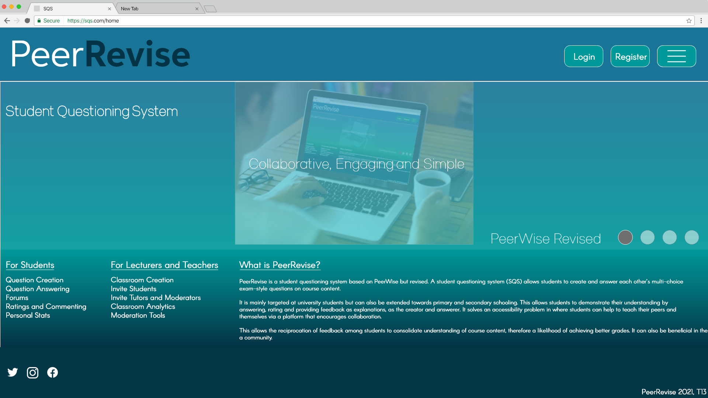

# Peerwise Project

This UX engineering project was the design, prototyping and testing of a Student Questioning System (SQS) based on [PeerWise](https://peerwise.cs.auckland.ac.nz/). Our goal was to redesign the PeerWise SQS through UX techniques to improve the system overall.  

In this repo, you will find our report in `project-report.md`.  
`personas` contains our selected persona pages and their images.  
`individual-designs` contains each team member's own design.  
`heuristics_analysis` contains each team member's heuristic evaluations for each others designs.  
`final-prototype` contains the pdf and images of our designs, fonts, the adobe xd file and our walkthough video.  
`testing` contains the documents associated with our user testing procedure